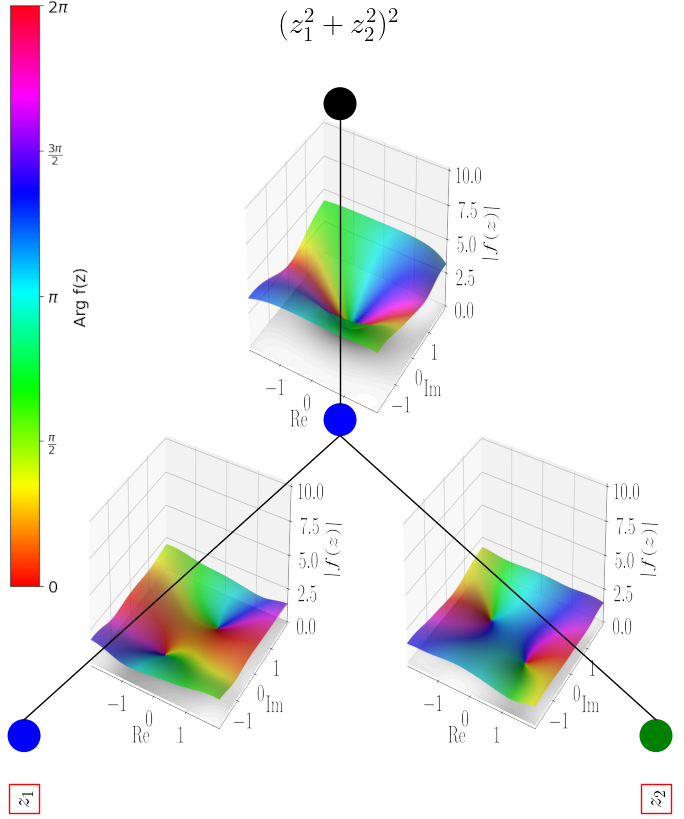

# [CVKAN: Complex-Valued Kolmogorov-Arnold Networks](https://arxiv.org/abs/2502.02417)
Authors: Matthias Wolff, Florian Eilers, Xiaoyi Jiang \
University of Münster, Department of Computer Science

Link to Paper: https://arxiv.org/abs/2502.02417

---

### Abstract
In this work we propose $`\mathbb{C}`$KAN, a complex-valued KAN, to join the intrinsic interpretability of KANs and the advantages of Complex-Valued Neural Networks (CVNNs). We show how to transfer a KAN and the necessary associated mechanisms into the complex domain. To confirm that $`\mathbb{C}`$KAN meets expectations we conduct experiments on symbolic complex-valued function fitting and physically meaningful formulae as well as on a more realistic dataset from knot theory. Our proposed $`\mathbb{C}`$KAN is more stable and performs on par or better than real-valued KANs while requiring less parameters and a shallower network architecture, making it more explainable.
<p align="center">

</p>

---

## Table of Contents

- [experiments](experiments): Scripts for our experiments and corresponding results
  - [fit_formulas.py](experiments/fit_formulas.py): Experiments for function fitting. Simple arbitrary $\left(z^2, \quad \sin(z), \quad z_1 \cdot z_2, \quad (z_1^2 + z_2^2)^2 \right)\quad$ as well as physically meaningful formulae (circuit & holography)
  - [knot_dataset.py](experiments/knot_dataset.py): Experiments for knot classification
  - [results.json](experiments/results.json): All of our results as a list of dictionaries, stored as JSON
  - [run_crossval.py](experiments/run_crossval.py): Script to run k-fold cross-validation on a dataset and model given. Also stores the results with additional meta-data in a json file
- [images](images): The images used in our paper
  - [visualizations.py](images/visualizations.py): Script to create some of the images we used in our paper
- [models](models):
  - [functions](models/functions): different helper functions ($`\mathbb{C}`$SiLU, BatchNorms)
    - [CompleySilu.py](models/functions/ComplexSilu.py): Two different variants of complex SiLU
    - [CV_LayerNorm.py](models/functions/CV_LayerNorm.py): Different complex-valued BatchNorm approaches and LayerNorm
  - [wrapper](models/wrapper): Folder contains Wrappers for every KAN to make them work with our KanPlotter and KanExplainer
    - [CVKANWrapper.py](models/wrapper/CVKANWrapper.py): Wrapper for our CVKAN
    - [PyKANWrapper.py](models/wrapper/PyKANWrapper.py): Wrapper for pyKAN
    - [WrapperTemplate.py](models/wrapper/WrapperTemplate.py): Template (Interface) for all specific KAN Wrappers
  - [CVKAN.py](models/CVKAN.py): $`\mathbb{C}`$KAN model definition
  - [FastKAN.py](models/FastKAN.py): modified version of FastKAN model definition, originally from Github Repository [ZiyaoLi/fast-kan](https://github.com/ZiyaoLi/fast-kan/blob/master/fastkan/fastkan.py)
- [train/train_loop.py](train/train_loop.py): Main loop for training all kinds of KANs on different datasets using custom loss functions
- [utils](utils): miscellaneous utils
  - [dataloading](utils/dataloading): utils for dataloading
    - [create_complex_dataset.py](utils/dataloading/create_complex_dataset.py): Create a complex-valued dataset dictionary based on a lambda expression as symbolic formula.
    - [crossval_splitter.py](utils/dataloading/crossval_splitter.py): Automatically create datasets for k-fold cross-validation
    - [csv_dataloader.py](utils/dataloading/csv_dataloader.py): Dataloader and Dataset-Class for a comma-seperated CSV file or dictionary
  - [latex](utils/latex): Utils to generate LaTeX outputs automatically
    - [latex_table_creator.py](utils/latex/latex_table_creator.py): Automatically generate resulting LaTeX tables from results.json
  - [plotting](utils/plotting): utils for plotting
    - [cplot.py](utils/plotting/cplot.py): Experiments with plotting standard complex-valued functions (i.e. $`z^2`$)
    - [cplotting_tools.py](utils/plotting/cplotting_tools.py): modified version of FastKAN model definition, originally from Github Repository [artmenlope/complex-plotting-tools](https://github.com/artmenlope/complex-plotting-tools/blob/master/cplotting_tools.py)
    - [plot_kan.py](utils/plotting/plot_kan.py): Plot KAN models (real-valued as well as complex-valued) with interactive elements
  - [eval_model.py](utils/eval_model.py): Evaluation of models and plotting of confusion matrix
  - [explain_kan.py](utils/explain_kan.py): Explain KAN models by calculating edge relevance scores in the same way as Ziming Liu's pyKAN 2.0
  - [json_editor.py](utils/json_editor.py): Manipulate the results.json file
  - [loss_functions.py](utils/loss_functions.py): MSE, MAE and cross entropy loss-functions
  - [misc.py](utils/misc.py): Miscellaneous short scripts and methods


---

## How to use
### Install
```bash
pip install cvkan
```

### $`\mathbb{C}`$KAN
````py
from cvkan import CVKAN

model = CVKAN()
````
### Plotting